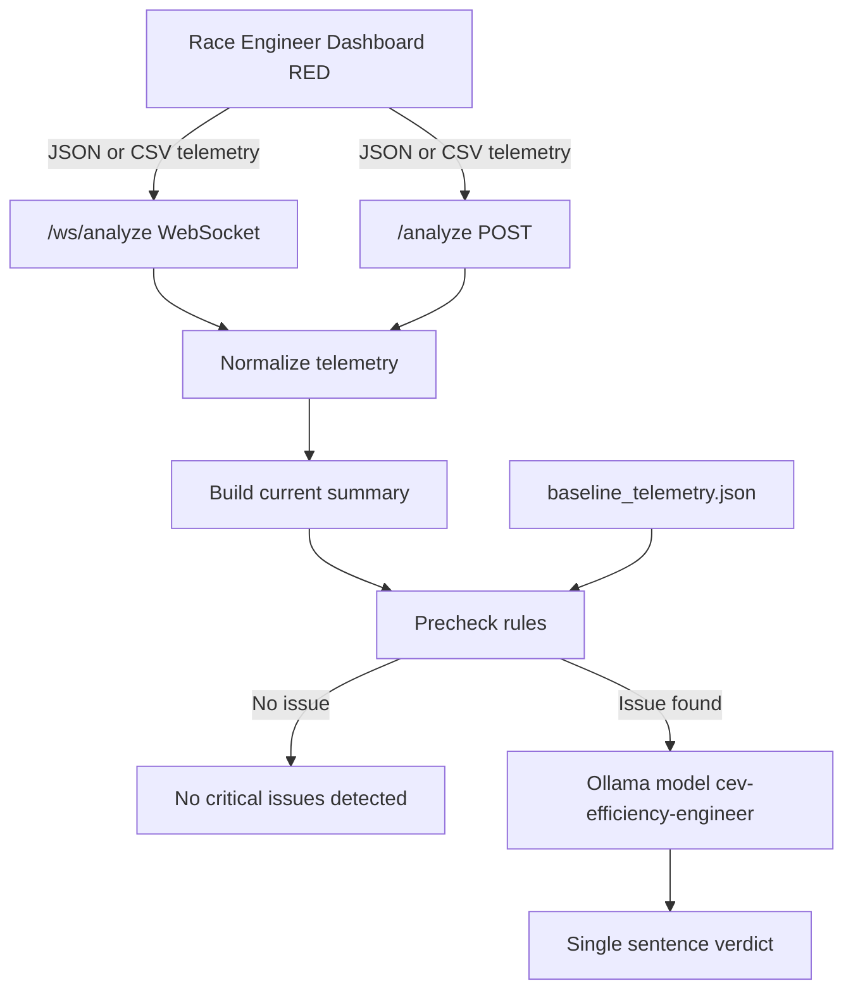

# Race-GPT

Race-GPT is a FastAPI service that receives live telemetry from RED (Race Engineer Dashboard), compares it to a baseline profile, runs deterministic prechecks, and returns a single sentence verdict.

## Architecture



RED is expected to call the endpoint in main.py, typically the websocket endpoint /ws/analyze for periodic updates.

## What the service does

1. Parses incoming telemetry from csv or json payload.
2. Normalizes data to canonical fields: seq, power_ts, current, voltage, power.
3. Builds summary statistics and electrical dynamics features.
4. Runs precheck logic against baseline_telemetry.json.
5. Returns:
    - No critical issues detected. when checks pass.
    - A one sentence warning or critical verdict when checks fail.

## Precheck breakdown

The precheck function in main.py evaluates these conditions in order:

1. Data validity:
    - At least 5 rows are required.
    - If power_ts exists, timestamps must not be constant.
2. Voltage sag guard:
    - Compares current minimum voltage to a baseline driven floor.
    - Uses baseline voltage p05 and adjusts for expected load effect using baseline dv_di_slope.
3. Current spike guard:
    - Flags if current peak exceeds 1.5x baseline current p95.
4. Power consistency guard:
    - Compares measured mean power to voltage mean times current mean.
    - Flags if relative mismatch is greater than 30 percent.
5. Dynamics deviation guard:
    - Uses baseline and current slope and residual metrics.
    - Flags if slope leaves the allowed baseline band and outlier fraction is high.

If any check fails, the decision text is passed to the model for a one sentence rewrite.

## Model behavior

Model: phi4-mini, wrapped as cev-efficiency-engineer via Modelfile.

System behavior:
1. Verbalize PRECHECK_DECISION as exactly one clear sentence.
2. Do not invent extra findings.
3. Keep output deterministic and concise.

The service also applies a final one sentence clamp before returning verdict.

## API contract

### POST /analyze

Request body fields:
1. csv: string, optional, raw CSV text.
2. json: object or array, optional, telemetry JSON payload.

At least one of csv or json must be provided.

Response:
```json
{"verdict":"..."}
```

### WebSocket /ws/analyze

Send JSON messages with either csv or json key and receive one verdict response per message.

## Input formats supported

1. Flat CSV rows with columns such as ros_time_sec, bus_voltage, current.
2. Snapshot JSON objects with nested power and other sections.
3. JSON list of telemetry rows.

Normalization and rename mapping are implemented in telemetry.py.

## Local setup

1. Install Python dependencies:
```bash
pip install fastapi uvicorn pandas numpy ollama requests websockets
```

2. Build the Ollama model:
```bash
ollama create cev-efficiency-engineer -f Modelfile
```

3. Generate or refresh baseline summary:
```bash
python write_telemetry.py
# optional custom source
python write_telemetry.py mock_baseline.csv --out baseline_telemetry.json
```

4. Run the API service:
```bash
python main.py
```

## Quick tests

REST test:
```bash
python test.py
```

WebSocket test:
```bash
python test_ws.py
```

## Key files

1. main.py: API endpoints, precheck logic, and model call.
2. telemetry.py: telemetry normalization and summary feature extraction.
3. write_telemetry.py: baseline summary generation.
4. Modelfile: deterministic one sentence model wrapper.
5. baseline_telemetry.json: baseline reference used by precheck.
